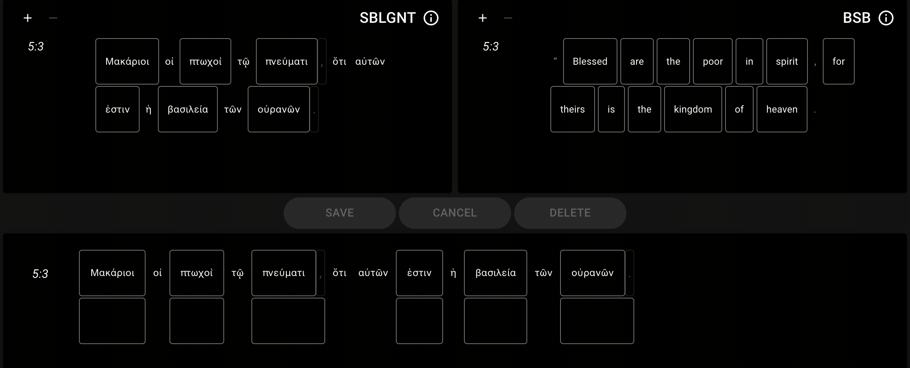
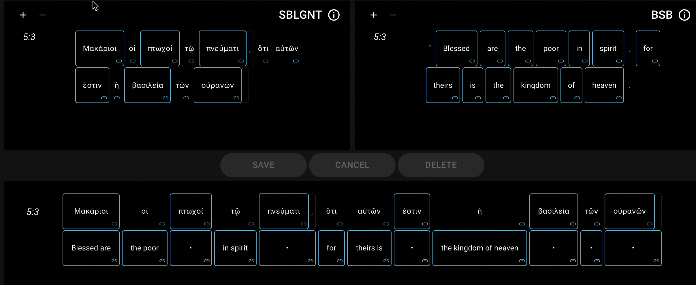
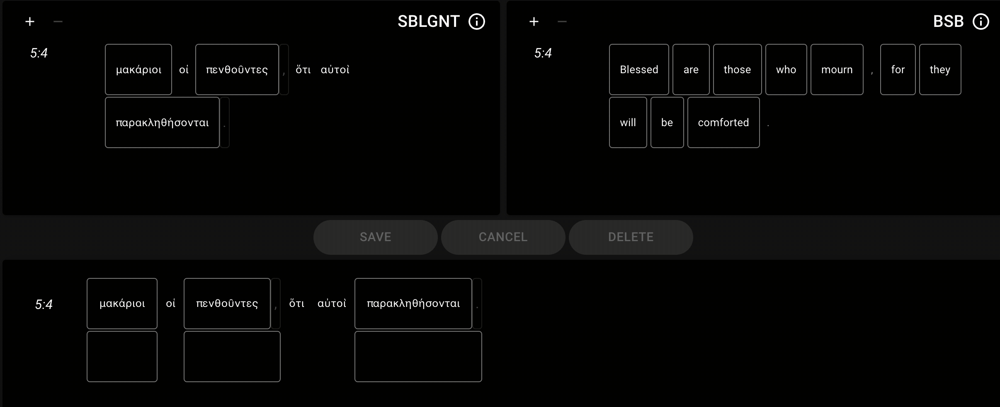
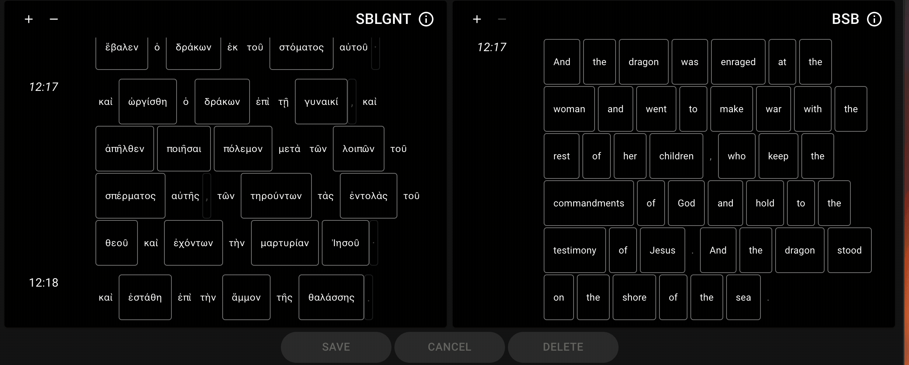

# Features

ClearAligner is designed to work with Alignment data for Biblical texts. Alignment to the Macula WLC Hebrew text and Macula SBLGNT Greek text are currently supported.

## Creating alignment data

<figure><figcaption>
Quickly create alignment records
</figcaption></figure>

## Editing alignment data

<figure><figcaption>
Easily edit alignment records
</figcaption></figure>

## Viewing alignment data

<figure><figcaption>
View existing alignments by hovering
</figcaption></figure>

## Automated Suggestions based on alignment history

<figure><figcaption>
Words that have been previosly aligned are suggested
</figcaption></figure>

## Align across verse boundaries

<figure><figcaption>
Align across verse boundaries when versification schemes differ
</figcaption></figure>

## Keyboard shortcuts for repetitive actions

* `Space` creates an alignment record once tokens are selected.
* `Backspace` deletes an alignment record when one is selected.
* `Shift + Escape` triggers the reset action.
* `Shift + ←` navigates to the previous verse.
* `Shift + →` navigates to the next verse.

## Approve alignments in batch

<figure><figcaption>
Approve multiple alignments at once
</figcaption></figure>

## Reject incorrect alignments

<figure><figcaption>
Mark incorrect alignments as "rejected"
</figcaption></figure>

## Flag alignments for review

<figure><figcaption>
Flag alignments for further review or discussion
</figcaption></figure>

