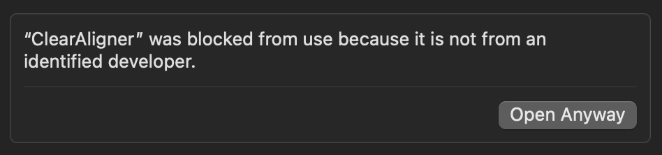

# 0.0.31

This release is for use in pilot projects and individual user testing.

## New Feature Highlights

* Support for alignment `status` and `origin`
* Batch editing of alignment `status` in the Concordance View
* Keyboard Shortcuts
* Bug fixes

ClearAligner comes with Young's Literal Translation as a default project. To experiment with alignment data for an entire Bible, download and import [YLT alignment data](https://drive.google.com/file/d/1hrDZ960GsCDWpGM8FSOvqdpmmUpegY1y/view?usp=drive\_link). To test ClearAligner with other texts, see [Getting Started](../getting-started.md#create-a-new-project).

## Builds

* [0.0.31, macOS](https://drive.google.com/file/d/16A7f8p-Y3Cu\_CtWiI4ErN5m7JC2Ubn1m/view?usp=drive\_link) (See [notes](0.0.31.md#macos))
* [0.0.31, Windows](https://drive.google.com/file/d/1zy-EufMGSICB5dfVpDfK2M0oT8K0JfFw/view?usp=drive\_link) (See [notes](0.0.31.md#windows))

### Keyboard Shortcuts

This version includes keyboard shortcuts for repetetive actions in the verse-level alignment editor:

* `Space` creates an alignment record once tokens are selected.
* `Backspace` deletes an alignment record when one is selected.
* `Shift + Escape` triggers the reset action.
* `Shift + ←` navigates to the previous verse.
* `Shift + →` navigates to the next verse.

### Installation Notes

#### macOS

This version of ClearAligner does not include an authorized macOS developer certificate. When trying to install ClearAligner, a message like this may be displayed:

<figure><figcaption><p>macOS blocks inital ClearAligner install</p></figcaption></figure>

This can be resolved by navigating to **System Settings** > **Privacy & Security** and selecting _**Open Anyway:**_&#x20;

<figure><figcaption><p>Select Open Anyway to use ClearAligner on macOS</p></figcaption></figure>

After doing so, the first time you open ClearAligner you will need to acknowledge one more warning, then smooth sailing is ahead:


<figure><figcaption><p>Acknowledge final macOS warning</p></figcaption></figure>

#### Removing data

There is currently no way to delete projects and local data in this build. If you need to delete your local data for testing purposes, run a command like:

```bash
rm -rf /Users/<USER>/Library/Application\ Support/clear-aligner
```

_**Be cautious when deleting data on your local machine.**_

#### Windows

#### Portion of the screen not visible

Depending on the screen resolution scaling setting in Windows, a portion of the ClearAligner UI may not be immediately visible. This will be addressed in future builds. For now, users can zoom in and out using `CTRL +` or `CTRL -` to resolve the problem.

#### Removing data

There is currently no way to delete projects and local data in this build. If you need to delete your local data for testing purposes, run a command like:

```powershell
Remove-Item -Path "C:\Users\<USER>\AppData\Roaming\clear-aligner" -Recurse -Force
```

_**Be cautious when deleting data on your local machine.**_
