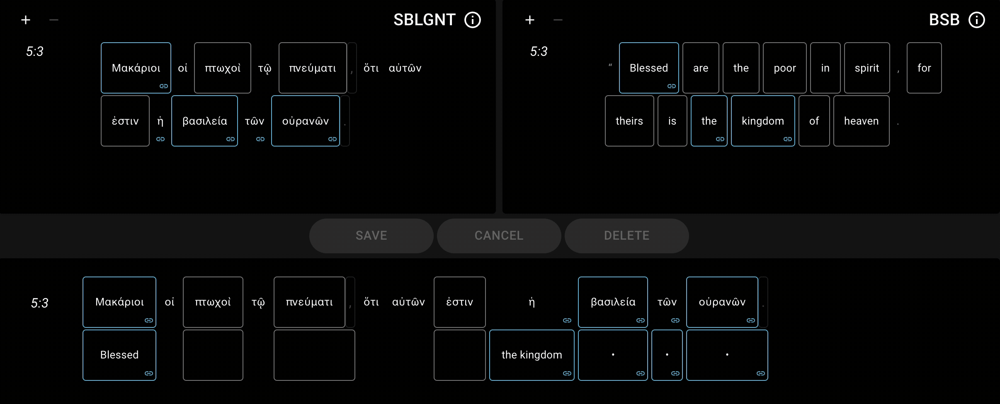
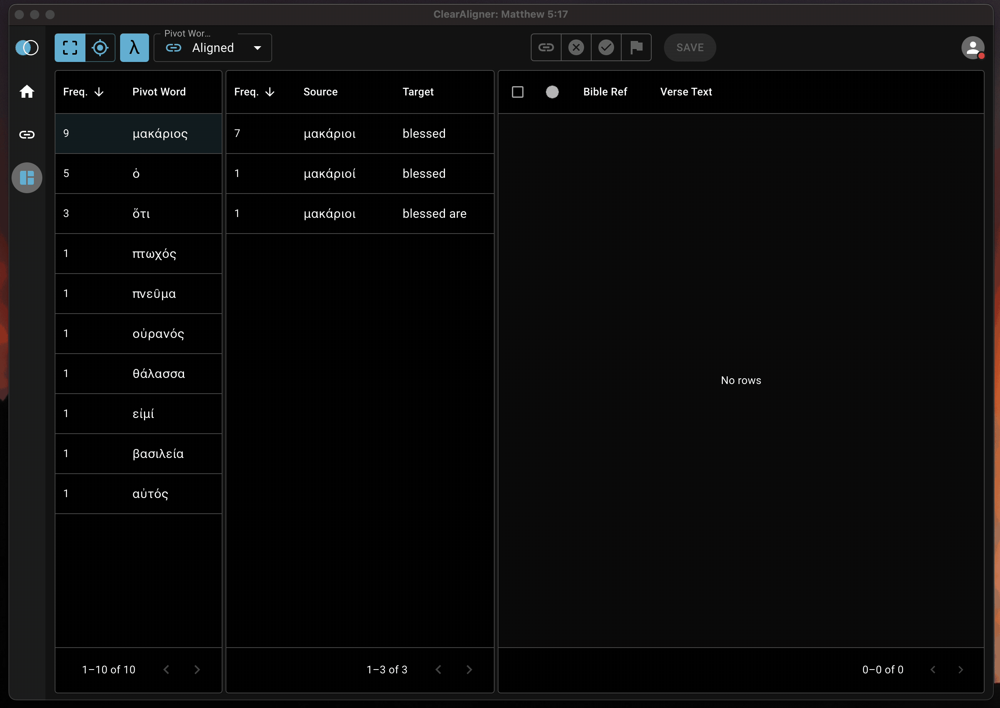
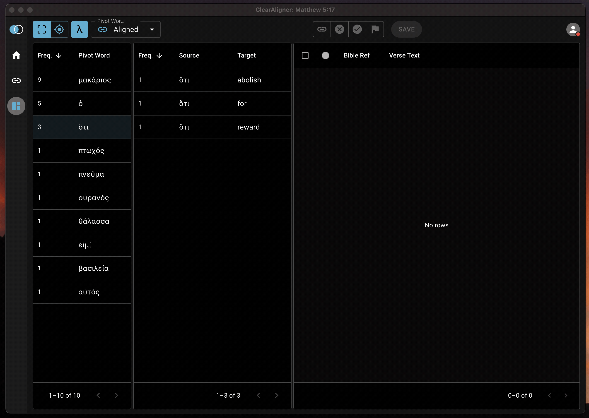
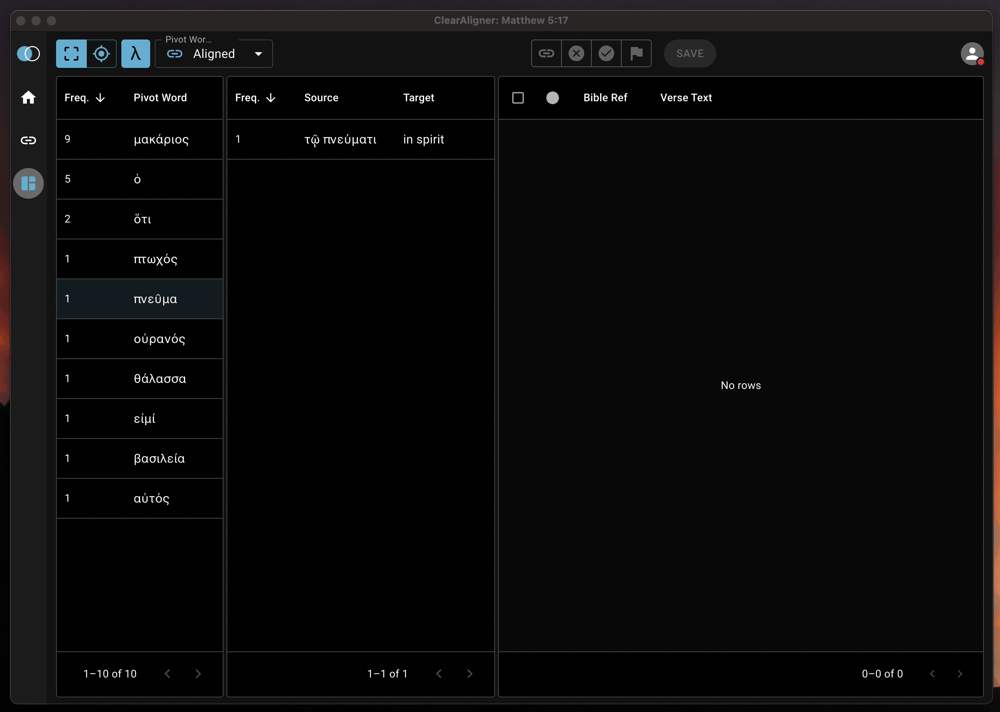

# Features

What can ClearAligner do?

ClearAligner is designed to work with Alignment data for Biblical texts. Alignment to the Macula WLC Hebrew text and Macula SBLGNT Greek text are currently supported.

## Creating alignment data

## Editing alignment data

## Viewing alignment data

## Automated Suggestions based on alignment history

## Align across verse boundaries

## Keyboard shortcuts for repetitive actions

* `Space` creates an alignment record once tokens are selected.
* `Backspace` deletes an alignment record when one is selected.
* `Shift + Escape` triggers the reset action.
* `Shift + ←` navigates to the previous verse.
* `Shift + →` navigates to the next verse.

## Approve alignments in batch

## Reject incorrect alignments

## Flag alignments for review

