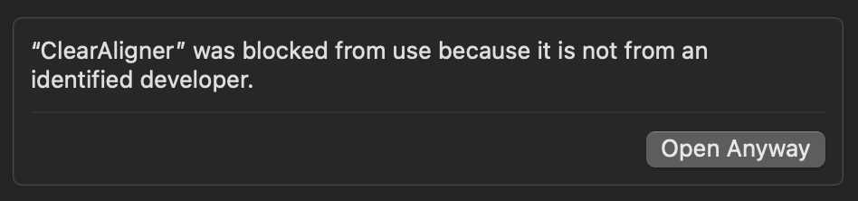

# 0.0.33

October 2024

This release contains several new features -- we are eager for your feedback!

<iframe width="560" height="315" src="https://www.youtube.com/embed/RuB5azbMJC0" title="ClearAligner Overview (0.0.33)" frameborder="0" allow="accelerometer; autoplay; clipboard-write; encrypted-media; gyroscope; picture-in-picture" allowfullscreen></iframe>

## New Feature Highlights

* Multi-User Synchronization Service ("ClearAligner Sync")
* Alignment Suggestions (based on history)
* Live Interlinear (see what is aligned at a glance)
* Updated User Interface
  * View and edit alignment status in Verse Editor
  * Redesigned home screen and project cards
  * Better use of space in Concordance view
* Bug fixes
  * Fixed: keyboard shortcuts can be used to create invalid links
  * Fixed: importing an alignment file with `needsReview` statuses causes error

## Builds

* [0.0.33, macOS](https://drive.google.com/file/d/1rMPPRY2w2TzYcaIqABARB3Fn6wala4jP/view?usp=sharing) (See notes)
* [0.0.33, Windows](https://drive.google.com/file/d/10LJBox_QN297iv6E_NNruMWf7uFMb7H3/view?usp=sharing) (See notes)

## Multi-User Project Synchronization

Members of the ClearAligner Sync service can now upload projects and share them with collaborators. Data conflicts are handled on a last-commit-wins basis. When online, users have the opportunity to sync their work. When offline, user can work with all of ClearAligner's features except synchronization.

.png)

## Alignment Suggestions

This feature can be toggled on/off in the settings menu.

.png)

When turned on, ClearAligner will suggest correlating tokens based up on the history of the alignment project. When users click on a source or target token, the project's history is searched for tokens that match the selection. Existing alignment records are sorted by frequency and ranked by alignment status. If a suggestion is correct, it can be created using the `Create Link` button or it's correlating keyboard shortcut. If the suggestion is incorrect, selecting any other token will deactivate it.

## Live Interlinear

In the bottom half of the Verse Editor view, there is now an interlinear that is populated as alignment records are created. This gives users the ability to quickly understand which words have been aligned so far.

.png)

### Installation Notes

#### macOS

This version of ClearAligner does not include an authorized macOS developer certificate. When trying to install ClearAligner, a message like this may be displayed:

.png){ width="276" }

This can be resolved by navigating to **System Settings** > **Privacy & Security** and selecting _**Open Anyway:**_

{ width="375" }

After doing so, the first time you open ClearAligner you will need to acknowledge one more warning, then smooth sailing is ahead:

.png){ width="277" }

#### Removing data

There is currently no way to delete projects and local data in this build. If you need to delete your local data for testing purposes, run a command like:

```bash
rm -rf /Users/<USER>/Library/Application\ Support/clear-aligner
```

_**Be cautious when deleting data on your local machine.**_

#### Windows

#### Portion of the screen not visible

Depending on the screen resolution scaling setting in Windows, a portion of the ClearAligner UI may not be immediately visible. This will be addressed in future builds. For now, users can zoom in and out using `CTRL +` or `CTRL -` to resolve the problem.

#### Removing data

There is currently no way to delete projects and local data in this build. If you need to delete your local data for testing purposes, run a command like:

```powershell
Remove-Item -Path "C:\Users\<USER>\AppData\Roaming\clear-aligner" -Recurse -Force
```

_**Be cautious when deleting data on your local machine.**_
